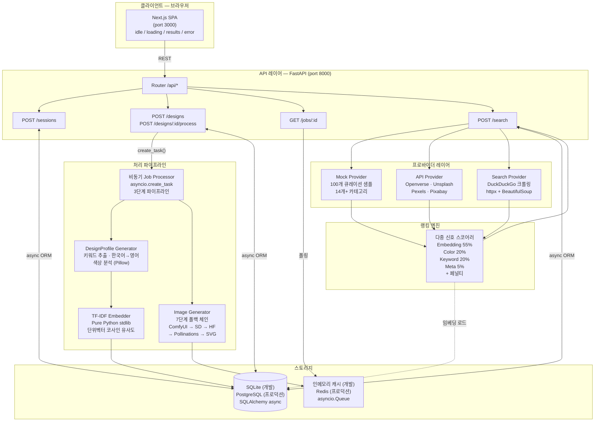
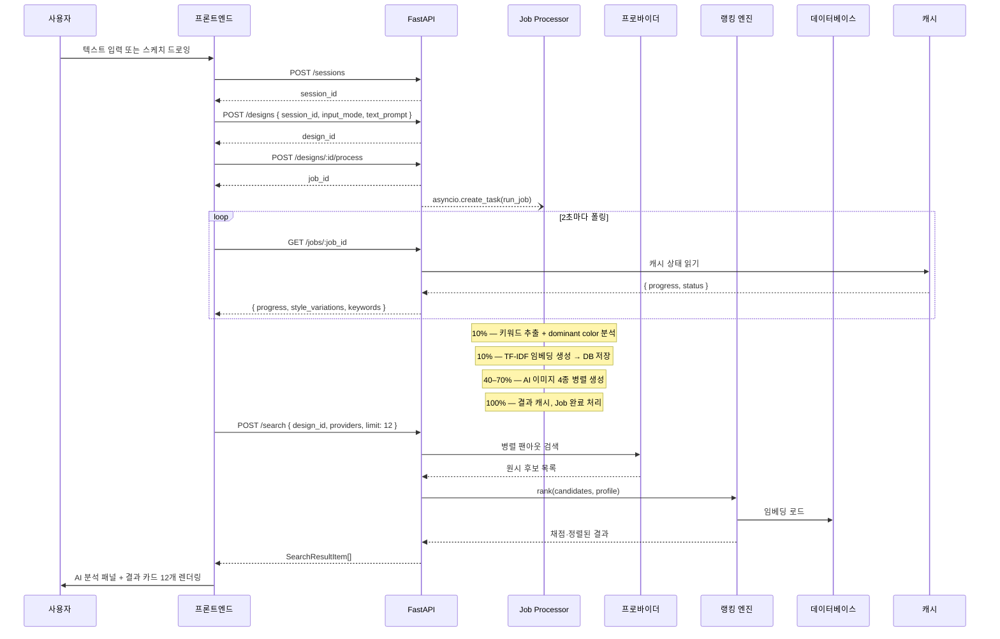

# FMD — Find My Design

FMD는 AI 기반 디자인 에셋 검색 엔진입니다. 찾고 싶은 디자인을 자연어 텍스트나 손스케치로 묘사하면, 시스템이 그 의도를 `DesignProfile`로 구조화하고 AI 레퍼런스 이미지를 생성한 뒤 여러 디자인 플랫폼에서 후보를 수집해 다중 신호 스코어링으로 랭킹합니다.

이 프로젝트는 비동기 API 설계, 멀티모달 AI 연동, 시맨틱 랭킹, 설정 기반 프론트엔드 아키텍처를 다루는 풀스택 포트폴리오입니다.

---

## 문제 정의

디자인 검색은 세 가지 구조적 문제를 갖고 있습니다.

**어휘 격차(Vocabulary Gap).** 디자이너는 무드, 구성, 색감, 타이포그래피의 에너지 같은 시각적 언어로 사고합니다. 그러나 플랫폼 검색 엔진은 정확한 키워드를 요구합니다. "따뜻한 톤의 유기적인 형태가 있는 미니멀 로고"와 "미니멀 로고"는 실제로 동일한 결과를 반환합니다. 검색 레이어가 시각적 의도를 표현하지 못하기 때문입니다.

**플랫폼 분산(Platform Fragmentation).** 고품질 디자인 에셋은 Dribbble, Behance, Figma Community, Freepik, Unsplash 등 수십 개의 플랫폼에 흩어져 있습니다. 같은 검색어를 각 플랫폼에 반복 입력하고, 탭을 오가며 결과를 직접 비교해야 합니다.

**낮은 키워드 재현율(Poor Recall).** 대부분의 플랫폼은 단순 태그 매칭을 사용합니다. "flat icon"으로 태그된 결과는 "clean pictogram" 쿼리에 노출되지 않습니다. 사용자 의도와 에셋 메타데이터 사이에 시맨틱 레이어가 없습니다.

---

## 해결 방식

FMD는 사용자 입력과 프로바이더 검색 사이에 `DesignProfile`이라는 구조화된 중간 표현을 도입합니다.

```
사용자 입력 (텍스트 또는 스케치)
  → DesignProfile { keywords[], dominant_color, embedding }
  → AI 레퍼런스 이미지 4종 (minimal / modern / vintage / bold)
  → 멀티 프로바이더 후보 검색
  → 다중 신호 랭킹 (embedding + color + keyword + meta)
  → 랭킹된 결과 UI 반환
```

**DesignProfile**은 한국어 쿼리(100개 이상의 번역 맵 포함)를 포함한 자유 형식 입력을 안정적이고 비교 가능한 구조로 정규화합니다. 동일한 프로파일이 이미지 생성, 프로바이더 검색, 랭킹의 세 시스템을 모두 구동합니다. 정렬된 키워드와 dominant color의 SHA-256 해시가 프로파일 ID(`profile_hash`)를 결정하며, 의미적으로 동일한 쿼리의 중복 연산을 방지합니다.

**랭킹 엔진**은 단순 태그 매칭 대신 TF-IDF 코사인 유사도, RGB 색상 거리, 키워드 겹침, 메타데이터 품질 신호를 가중 합산하여 결과를 의미 있는 순서로 정렬합니다.

---

## 시스템 아키텍처



### 컴포넌트별 책임

| 컴포넌트 | 책임 |
|---|---|
| **Next.js SPA** | 4상태 UI 머신(idle → loading → results → error). 모든 API 호출은 `lib/api.ts`에 격리. 카테고리·필터는 설정 객체로 렌더링. |
| **API Router** | 비즈니스 로직 없는 얇은 라우팅 레이어. 각 엔드포인트 모듈은 정확히 하나의 리소스를 담당. |
| **DesignProfile Generator** | 텍스트·스케치 멀티모달 입력을 `{ keywords, dominant_color, profile_hash }`로 정규화. 추출 전 한국어→영어 번역 처리. |
| **TF-IDF Embedder** | Python stdlib만으로 키워드에서 단위벡터 희소 임베딩 생성. JSON bytes로 직렬화해 BLOB으로 저장. |
| **Image Generator** | `asyncio.gather`로 4가지 스타일 변형을 병렬 생성. 7개 백엔드를 우선순위 순으로 시도하며 항상 결과를 반환. |
| **비동기 Job Processor** | `asyncio.create_task`로 실행 — HTTP 응답을 절대 블로킹하지 않음. 진행률을 캐시에 기록, 클라이언트가 독립적으로 폴링. |
| **Provider Layer** | 모든 프로바이더는 `BaseProvider.search(keywords, category, color, limit)` 구현. 팬아웃·수집은 검색 엔드포인트가 담당. |
| **Ranking Engine** | 4개의 독립 신호로 각 후보를 DesignProfile과 비교 채점. 신호별 점수 분해와 설명 목록이 포함된 정렬 결과 반환. |
| **Storage** | 커스텀 컬럼 타입(`GUID`, `JSONType`, `StringArray`)이 SQLite·PostgreSQL 양쪽에서 정확히 동작 — 코드 변경 없이 DB 전환 가능. |
| **Cache** | `core/redis.py`가 `asyncio.Queue`와 `dict`로 Redis 전체 인터페이스 구현. `REDIS_URL` 설정 시 실제 Redis로 전환. |

### 모듈성과 확장성의 근거

API 티어는 무상태(stateless)입니다. Job은 비동기로 디스패치되고, 상태는 HTTP 커넥션이 아닌 캐시 레이어를 통해 읽힙니다. API 인스턴스를 수평 확장할 때 인스턴스 간 조율이 필요 없습니다.

프로바이더 레이어는 개방된 확장 지점입니다. 프로바이더를 추가할 때는 인터페이스 구현 하나와 등록 호출 하나만 필요하며, 라우팅·랭킹·프론트엔드는 변경이 없습니다. 프로바이더 장애는 격리됩니다 — 크롤 타임아웃이 Mock 또는 API 프로바이더 결과에 영향을 주지 않습니다.

랭킹 함수는 가중치를 파라미터로 받아 주입 가능합니다. 랭킹 실험을 실행하려면 새 `RankingWeights` 설정만 있으면 되고 코드 변경은 불필요합니다.

---

## 데이터 흐름



### 단계별 설명

**세션 부트스트랩.** 페이지 로드 시 프론트엔드가 `POST /sessions`로 세션을 생성합니다. 백엔드는 클라이언트 IP를 해시하고 User-Agent를 저장합니다. 반환된 `session_id`는 React ref에 보관됩니다 — 렌더링을 구동하지 않으므로 state가 아닌 ref입니다.

**디자인 제출.** `POST /designs`가 `Design` 레코드를 생성합니다. 입력은 텍스트 프롬프트 문자열이거나 드로잉 캔버스에서 나온 base64 인코딩 PNG이며, 선택적 카테고리 힌트(UI / Logo / Icon / Illustration)가 포함됩니다.

**Job 디스패치.** `POST /designs/:id/process`가 `Job` 레코드를 생성하고 `asyncio.create_task(run_job(...))`를 실행합니다. HTTP 응답은 즉시 `job_id`를 반환합니다. 클라이언트는 처리 작업에 절대 블로킹되지 않습니다.

**DesignProfile 생성 (10%).** Job Processor가 `profile_generator.generate()`를 호출합니다. 텍스트 입력의 경우: 한국어 단어를 100개 이상의 번역 맵으로 변환하고, 불용어를 제거하며, 남은 토큰이 키워드 목록이 됩니다. 색상명 토큰은 `dominant_color`를 설정합니다. 캔버스 입력의 경우: 비흰색 픽셀을 32비트 버킷으로 양자화하고, 가장 빈번한 버킷이 `dominant_color`가 됩니다. 정렬된 키워드와 색상의 SHA-256이 `profile_hash`를 생성합니다 — 이미 존재하면 기존 프로파일을 재사용합니다.

**임베딩 생성 (10%).** `embedder.build(keywords)`가 항목별로 `log(1 + tf)`를 계산하고, L2 정규화로 단위벡터를 만들고, JSON bytes로 직렬화합니다. `design_profiles.embedding`에 BLOB으로 저장됩니다.

**이미지 생성 (40–70%).** `asyncio.gather`가 스타일별 프롬프트 접미사와 함께 4개의 동시 생성 호출을 디스패치합니다. 각 호출은 폴백 체인을 순서대로 시도합니다: ComfyUI → Stability AI → HuggingFace → Stable Horde → Pollinations → Openverse → 결정론적 로컬 SVG. 4가지 변형이 모두 완료되어야 다음 단계로 진행됩니다.

**검색 및 랭킹.** 프론트엔드가 `job.status == "done"`을 감지하면 `POST /search`를 호출합니다. 검색 엔드포인트가 DB에서 `DesignProfile`을 로드하고, 등록된 모든 프로바이더에 병렬로 팬아웃하며, 후보를 수집해 랭킹 엔진에 전달합니다. 각 후보는 4개 신호로 채점되고 내림차순으로 정렬됩니다. 상위 12개 결과가 신호별 점수와 읽을 수 있는 설명 목록과 함께 반환됩니다.

**UI 렌더링.** `page.tsx`가 `results` 상태로 전환됩니다. AI 분석 패널에 키워드, dominant color, 4개 스타일 이미지를 표시합니다. 그 아래 반응형 그리드에 `ProductCard` 12개를 렌더링합니다. 각 카드는 이미지(폴백 처리 포함), 제목, 가격, 소스, 매칭 점수, 설명 칩을 표시합니다.

---

## 엔지니어링 결정

### DesignProfile을 중간 구조로 도입한 이유

가장 직접적인 구현은 사용자 텍스트를 그대로 프로바이더에 전달하는 것입니다. 하지만 이 방식은 세 가지 경우에 즉시 실패합니다: 입력이 스케치인 경우(전달할 텍스트가 없음), 사용자가 한국어로 작성한 경우(프로바이더는 영어를 기대), 두 사용자가 같은 디자인을 다른 표현으로 묘사한 경우(중복 제거 불가).

`DesignProfile`은 세 가지 문제를 동시에 해결합니다. 원본 입력을 다시 파싱하지 않아도 모든 하위 시스템이 동작할 수 있는 정규화된 공통 표현입니다. `profile_hash`가 구조를 식별자로 만듭니다 — 동일한 해시를 생성하는 두 쿼리는 프로파일 레코드를, 임베딩을, 궁극적으로는 캐시된 검색 결과를 공유합니다 — 쿼리 수준의 조율 없이.

또한 관심사를 명확하게 분리합니다. 프로파일 생성기는 정규화를 담당하고, 임베더는 시맨틱 인코딩을 담당하고, 랭킹 엔진은 채점을 담당합니다. 각각은 독립적으로 변경 가능합니다.

### 설정 기반 UI를 선택한 이유

하드코딩된 필터 값과 카테고리 목록은 암묵적 결합을 만듭니다. PM이 "모션 / GIF"를 카테고리로 추가하려면 엔지니어가 올바른 JSX를 찾아 수정하고, 테스트를 작성하고, 배포해야 합니다. 변경의 파급 범위가 보이지 않습니다.

FMD에서는 모든 카테고리형 UI 요소가 설정 객체로 렌더링됩니다:

```typescript
// src/configs/console/filters.ts
export const FILTER_CONFIG: FilterConfig[] = [
  { id: "category", label: "카테고리", type: "select",       options: CATEGORY_OPTIONS },
  { id: "style",    label: "스타일",   type: "multi-select", options: STYLE_OPTIONS   },
]
```

필터 추가는 설정 변경입니다. 렌더링 컴포넌트는 변경하지 않습니다. A/B 테스트도 저렴합니다 — 변형 A와 변형 B는 다른 설정 객체이지, 다른 컴포넌트 트리가 아닙니다.

### 멀티 프로바이더 검색을 선택한 이유

단일 프로바이더는 재현율(recall)에 한계가 있습니다. 큐레이션된 Mock 샘플은 안정적인 기본 커버리지를 제공하고, API 프로바이더는 안정적인 메타데이터를 가진 라이선스 에셋을 공급하며, 웹 크롤링은 API로는 접근할 수 없는 롱테일 결과에 도달합니다. 소스의 합집합이 재현율을 향상시키는 대신 지연 시간이 추가되는 트레이드오프가 있습니다 — 검색이 사용자의 주의를 이미 차지하는 분석 단계 이후에 실행되므로 허용 가능한 트레이드오프입니다.

`BaseProvider` 인터페이스(`search(keywords, category, color, limit) → List[SearchCandidate]`)는 검색 엔드포인트, 랭킹 엔진, 프론트엔드를 건드리지 않고 새 소스를 추가할 수 있게 합니다. 프로바이더 실패는 팬아웃 루프의 try-catch로 격리됩니다.

### 랭킹 엔진을 구현한 이유

단순 태그 매칭은 결과를 임의 순서로 반환합니다. 랭킹 없이는 첫 번째 결과가 마지막 결과만큼 무관련할 수 있습니다. 사용자가 정렬을 신뢰할 수 없으므로 모든 결과를 수동으로 검토하게 됩니다.

랭킹 엔진은 4개의 독립 신호를 결합해 정렬에 의미를 부여합니다:

```python
score = (
    0.55 * embedding_score  +   # 시맨틱 유사도 (TF-IDF 코사인)
    0.20 * color_score      +   # 시각적 유사도 (RGB 유클리드 거리)
    0.20 * keyword_score    +   # 태그 겹침 수
    0.05 * meta_score           # 이미지 URL 존재 + 중복 제거
)
```

가중치는 명시적이며 주입 가능합니다. 각 신호는 독립적으로 해석 가능합니다. 결과별 `explanation` 목록(예: `["visual similarity", "color match"]`)은 임계값 이상으로 활성화된 신호에서 파생되며 — 결과 카드의 읽기 가능한 칩으로 UI에 노출됩니다.

가중치 설정은 `src/configs/console/policies.ts`에 있으며 Config Studio 어드민 패널에서 런타임에 편집 가능합니다. 배포 없이 비엔지니어도 랭킹을 조정할 수 있습니다.

---

## 주요 기능

- **멀티모달 입력** — 자유 형식 텍스트(한국어·영어) 또는 HTML5 캔버스 스케치. 양쪽 모두 동일한 `DesignProfile`을 생성
- **한국어 지원** — 100개 이상의 한국어→영어 번역 맵, 한글 불용어 필터링. `고양이` → `cat` 변환 후 키워드 추출
- **AI 스타일 변형 4종** — minimal / modern / vintage / bold를 `asyncio.gather`로 병렬 생성
- **7단계 이미지 생성 폴백** — ComfyUI → Stability AI → HuggingFace → Stable Horde → Pollinations → Openverse → 로컬 SVG. API 키 없이도 동작
- **멀티 프로바이더 검색** — Mock 카탈로그, Openverse API, DuckDuckGo 웹 크롤링. `BaseProvider`로 확장 가능
- **다중 신호 랭킹** — Embedding(55%) + Color(20%) + Keyword(20%) + Meta(5%), 승산적 페널티 포함
- **외부 ML 라이브러리 없음** — TF-IDF 임베딩을 Python stdlib(`math`, `json`, `collections`)만으로 구현
- **인프라 없는 개발 환경** — 인메모리 큐, 인메모리 캐시, SQLite. Docker나 Redis 없이 로컬 실행 가능
- **이식 가능한 DB 타입** — 커스텀 `GUID`, `JSONType`, `StringArray` 컬럼 타입. 개발은 SQLite, 프로덕션은 PostgreSQL. 코드 변경 없음
- **Enterprise Console** — `/admin` 대시보드: 검색 실행 관측, Job 타임라인, 랭킹 디버거, Config Studio

### 샘플 출력

`고양이`를 검색했을 때 내장 Mock 샘플 100개에서 반환된 결과:


---

## 확장성

### 새 디자인 프로바이더 추가

`BaseProvider`를 구현하는 클래스를 만들고 등록합니다:

```python
# backend/app/providers/dribbble_provider.py
class DribbbleProvider(BaseProvider):
    async def search(
        self,
        keywords: list[str],
        category: str | None,
        dominant_color: str | None,
        limit: int,
    ) -> list[SearchCandidate]:
        ...
```

`providers/registry.py`에 등록하고 `main.py` lifespan에서 시드합니다. 검색 엔드포인트, 랭킹 엔진, 프론트엔드는 변경이 없습니다.

### 새 랭킹 알고리즘 추가

랭킹 함수 시그니처가 명시적 가중치를 받습니다:

```python
def rank(
    candidates: list[SearchCandidate],
    profile: DesignProfile,
    weights: RankingWeights = DEFAULT_WEIGHTS,
) -> list[RankedResult]: ...
```

새 `RankingWeights` 인스턴스가 곧 새 알고리즘입니다. Config Studio 어드민 패널에서 실시간으로 편집하거나 A/B 실험을 위해 요청별로 주입할 수 있습니다.

### 새 검색 신호 추가

1. `SearchCandidate`에 필드 추가 (해당 신호를 지원하는 프로바이더가 채움)
2. `ranking.py`에 점수 컴포넌트 추가
3. `RankingWeights`에 가중치 추가
4. `search_results` 테이블에 점수 컬럼 추가

후보 수집과 채점이 이미 분리되어 있습니다. 신호 추가는 덧붙이는 작업이며 어떤 프로바이더나 API 계약도 변경하지 않습니다.

### 검색 트래픽 스케일링

API 티어는 무상태입니다. Job 상태는 캐시 레이어(인메모리 → Redis)를 통해 흐르며, Job을 생성한 HTTP 커넥션을 통하지 않습니다. 수평 확장은 `REDIS_URL` 설정만 필요하며 애플리케이션 코드 변경이 없습니다. 프로바이더 팬아웃은 이미 `asyncio.gather`를 사용하므로 프로바이더가 늘어나도 검색 엔드포인트 구조를 변경할 필요가 없습니다.

---

## 향후 개선 방향

| 영역 | 방향 |
|---|---|
| **임베딩 품질** | TF-IDF를 `all-MiniLM-L6-v2` 같은 sentence-transformer나 CLIP 텍스트 인코더로 교체해 시맨틱 정밀도 향상 |
| **비주얼 검색** | 캔버스 입력을 CLIP 이미지 인코더로 라우팅. `visual_score`를 다섯 번째 랭킹 신호로 추가 |
| **벡터 데이터베이스** | 스케일에서 근사 최근접 이웃 검색을 위해 pgvector 또는 Qdrant에 임베딩 저장 |
| **개인화** | 결과 클릭 추적. 이전 세션에서 사용자가 상호작용한 후보에 가중치 부여 |
| **실시간 제안** | 사용자가 타이핑하는 동안 경량 프리픽스 인덱스를 사용해 키워드 제안 스트리밍 |
| **결과 캐싱** | 동일한 `profile_hash`에 대해 프로바이더 검색 재실행 없이 저장된 결과 반환 |
| **프로바이더 확장** | Dribbble, Behance, Figma Community, Freepik 프로바이더 어댑터 구현 |
| **인증** | 영구 히스토리, 저장된 검색, 크로스 디바이스 세션을 위한 선택적 계정 레이어 |

---

## 로컬 실행

### 사전 요구사항

- Python 3.10+
- Node.js 18+ 및 pnpm

### 설치

```bash
git clone https://github.com/devbinlog/FMD.git
cd FMD

# 백엔드
cd backend && pip install -r requirements.txt && cd ..

# 프론트엔드
cd frontend && pnpm install && cd ..
```

### 환경 변수 (모두 선택 사항)

`backend/.env` 생성:

```bash
# AI 이미지 생성 — 하나만 있으면 충분
HF_TOKEN=hf_...                # HuggingFace 무료 티어 (권장)
STABILITY_API_KEY=sk-...       # Stability AI
COMFYUI_URL=http://localhost:8188

# 검색 결과 이미지
UNSPLASH_ACCESS_KEY=...
PEXELS_API_KEY=...
PIXABAY_API_KEY=...

# 프로덕션 전환
DATABASE_URL=postgresql+asyncpg://...
REDIS_URL=redis://...
```

모든 키는 선택 사항입니다. 키 없이도 Openverse(CC 라이선스, 키 불필요)와 내장 Mock 샘플 100개로 전체 파이프라인이 동작합니다.

### 실행

```bash
pnpm dev        # 프론트엔드 :3000 + 백엔드 :8000 동시 실행

pnpm dev:fe     # 프론트엔드만 → http://localhost:3000
pnpm dev:be     # 백엔드만    → http://localhost:8000
                #               http://localhost:8000/docs  (Swagger UI)
```

### 테스트

```bash
pnpm test:be                      # 전체 백엔드 테스트
pnpm test:be:one "test_name"      # 단일 테스트
```

---

## 프로젝트 구조

```
├── backend/
│   ├── app/
│   │   ├── api/            # 라우트 핸들러 — sessions, designs, jobs, search
│   │   ├── core/           # 설정, DB 엔진, 이식 가능한 컬럼 타입, 인메모리 캐시
│   │   ├── data/           # Mock 상품 샘플 100개 (design_refs.py)
│   │   ├── models/         # SQLAlchemy ORM — 7개 테이블
│   │   ├── schemas/        # Pydantic v2 요청/응답 모델
│   │   ├── providers/      # BaseProvider + mock / api / search 구현체
│   │   ├── services/
│   │   │   ├── profile_generator.py   # 키워드 추출, 색상 분석, 한국어 번역
│   │   │   ├── image_generator.py     # 7단계 폴백 이미지 생성
│   │   │   ├── embedder.py            # TF-IDF 임베딩 (stdlib만 사용)
│   │   │   └── ranking.py             # 다중 신호 랭킹 알고리즘
│   │   ├── worker/
│   │   │   └── processor.py           # 인라인 비동기 Job Processor
│   │   └── main.py                    # FastAPI 진입점, DB 초기화, 프로바이더 시딩
│   ├── tests/
│   └── requirements.txt
├── frontend/
│   ├── src/
│   │   ├── app/
│   │   │   ├── page.tsx               # SPA — 4상태 머신
│   │   │   └── admin/                 # Enterprise Console (/admin)
│   │   ├── components/
│   │   │   ├── Header.tsx
│   │   │   ├── InputModeTabs.tsx
│   │   │   ├── TextPromptPanel.tsx
│   │   │   ├── DrawingCanvas.tsx
│   │   │   ├── CategorySelector.tsx
│   │   │   ├── ProductCard.tsx
│   │   │   ├── HistoryPanel.tsx
│   │   │   └── admin/                 # 콘솔 컴포넌트
│   │   ├── configs/
│   │   │   └── console/               # columns.ts, filters.ts, policies.ts
│   │   ├── lib/
│   │   │   ├── api.ts                 # API 클라이언트 + Job 폴링
│   │   │   └── mock/                  # 결정론적 Mock 데이터 (시드 42, 1,000건)
│   │   └── types/api.ts               # TypeScript 타입 정의
│   └── package.json
├── docs/                              # 엔지니어링 설계 문서
└── package.json                       # 루트 워크스페이스 스크립트
```

---

## API 레퍼런스

| 메서드 | 경로 | 설명 |
|---|---|---|
| `POST` | `/api/sessions` | 검색 세션 생성 |
| `GET` | `/api/sessions/:id/history` | 세션의 최근 검색 20건 조회 |
| `POST` | `/api/designs` | 디자인 제출 — 텍스트 프롬프트 또는 캔버스 PNG |
| `POST` | `/api/designs/:id/process` | 비동기 AI 처리 Job 시작 |
| `GET` | `/api/jobs/:id` | Job 진행률 폴링 및 결과 조회 |
| `POST` | `/api/search` | 등록된 프로바이더에 대해 랭킹 검색 실행 |
| `GET` | `/health` | 헬스 체크 |

---

## 기술 스택

| 레이어 | 기술 |
|---|---|
| 프론트엔드 | Next.js 16 · React 19 · TypeScript · Tailwind CSS v4 |
| 백엔드 | FastAPI · Python 3.11 · Pydantic v2 |
| ORM | SQLAlchemy 2.0 async |
| 데이터베이스 | SQLite (개발) · PostgreSQL (프로덕션) |
| 큐 / 캐시 | asyncio.Queue (개발) · Redis (프로덕션) |
| HTTP 클라이언트 | httpx async |
| HTML 스크레이핑 | BeautifulSoup4 · lxml |
| 이미지 생성 | Stability AI · HuggingFace Inference · Pollinations.ai · Openverse |
| 아이콘 | Lucide React |

---

*FMD는 비동기 API 설계, 멀티모달 AI 연동, 시맨틱 검색 랭킹, 설정 기반 프론트엔드 아키텍처를 다루는 풀스택 포트폴리오 프로젝트입니다.*
