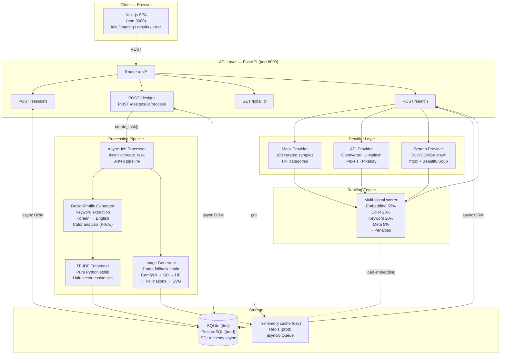
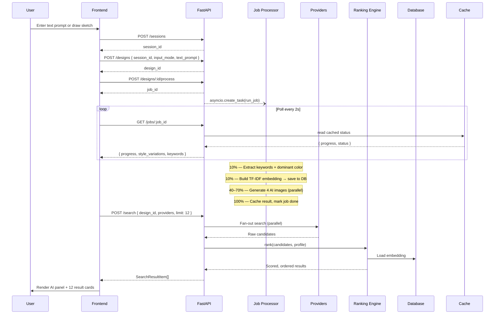

# FMD — Find My Design

FMD is an AI-powered design asset search engine built for designers who know what they want visually but struggle to articulate it in keywords. Users describe a design intent through natural language or a freehand sketch. The system parses that intent into a structured `DesignProfile`, generates AI reference images, fans out searches across multiple design providers, and ranks results using a multi-signal scoring model.

This project demonstrates end-to-end product engineering: async API design, multi-modal AI integration, semantic ranking, and configuration-driven frontend architecture.

---

## Problem

Design search today is broken in three ways.

**The vocabulary gap.** Designers think in visual terms — mood, composition, color weight, typographic energy — but design platform search engines expect precise keywords. "Minimal logo with warm tones and organic shapes" returns the same undifferentiated results as "minimal logo". The search layer cannot represent visual intent.

**Platform fragmentation.** High-quality design assets are scattered across Dribbble, Behance, Figma Community, Freepik, Unsplash, and dozens of niche marketplaces. Finding the right reference requires manually searching each platform with the same query, context-switching between tabs, and mentally aggregating results.

**Poor keyword recall.** Most design asset platforms use simple tag matching. A result tagged "flat icon" will not surface for a query like "clean pictogram", even though the two describe the same visual style. There is no semantic layer between the user's intent and the asset's metadata.

---

## Solution

FMD introduces a structured intermediate representation called `DesignProfile` that sits between user input and provider search.

```
User Input (text or sketch)
  → DesignProfile { keywords[], dominant_color, embedding }
  → 4 AI reference images (minimal / modern / vintage / bold)
  → Multi-provider candidate search
  → Multi-signal ranking (embedding + color + keyword + meta)
  → Ranked results returned to UI
```

**DesignProfile** normalizes free-form input — including Korean-language queries via a 100+ word translation map — into a stable, comparable structure. The same profile drives all downstream systems: image generation, provider search, and ranking. Profile identity is determined by a SHA-256 hash of sorted keywords and dominant color, enabling deduplication of semantically identical queries.

**The ranking engine** replaces raw tag matching with a weighted combination of TF-IDF cosine similarity, RGB color distance, keyword overlap, and metadata quality signals, making results meaningfully ordered rather than arbitrary.

---

## System Architecture



### Component Responsibilities

| Component | Responsibility |
|---|---|
| **Next.js SPA** | Four-state UI machine (idle → loading → results → error). All API calls isolated in `lib/api.ts`. Config-driven categories and filters. |
| **API Router** | Thin routing layer with no business logic. Each endpoint module handles exactly one resource. |
| **DesignProfile Generator** | Normalizes multi-modal input (text + sketch) into `{ keywords, dominant_color, profile_hash }`. Handles Korean-to-English translation before extraction. |
| **TF-IDF Embedder** | Builds a sparse unit-vector embedding from keywords using only Python stdlib. Serializes to JSON bytes for storage as a BLOB. |
| **Image Generator** | Generates four style variations in parallel via `asyncio.gather`. Tries seven backends in priority order, always producing a result. |
| **Async Job Processor** | Runs as an `asyncio.create_task` — never blocks the HTTP response. Writes progress to cache; client polls independently. |
| **Provider Layer** | All providers implement `BaseProvider.search(keywords, category, color, limit)`. Fan-out and collection are handled by the search endpoint, not the providers. |
| **Ranking Engine** | Scores each candidate against the `DesignProfile` on four independent signals. Returns an ordered list with per-result score breakdown and explanation. |
| **Storage** | `GUID`, `JSONType`, and `StringArray` custom column types render correctly on both SQLite and PostgreSQL — zero code changes to switch databases. |
| **Cache** | `core/redis.py` implements the full Redis interface using `asyncio.Queue` and a `dict`. Drops into Redis when `REDIS_URL` is set. |

### Why this architecture is modular and scalable

The API tier is stateless. Jobs are dispatched asynchronously and their status is read through the cache layer, not from the HTTP connection that created them. This means API instances can be scaled horizontally without coordination.

The provider layer is an open extension point. Adding a provider requires implementing one interface and one registration call — no changes to routing, ranking, or the frontend. Provider failures are isolated; a crawl timeout does not affect mock or API provider results.

The ranking function accepts explicit weights as parameters, making it injectable. Running a ranking experiment requires a new `RankingWeights` config, not a code change.

---

## Data Flow



### Step-by-step explanation

**Session bootstrap.** On page load the frontend creates a session via `POST /sessions`. The backend hashes the client IP and stores the user agent. The returned `session_id` is held in a React ref — it is not state because it does not drive rendering.

**Design submission.** `POST /designs` creates a `Design` record with the raw input: either a text prompt string or a base64-encoded PNG from the drawing canvas, plus an optional category hint (UI / Logo / Icon / Illustration).

**Job dispatch.** `POST /designs/:id/process` creates a `Job` record and fires `asyncio.create_task(run_job(...))`. The HTTP response returns immediately with a `job_id`. The client is never blocked on processing.

**DesignProfile generation (10%).** The job processor calls `profile_generator.generate()`. For text input: Korean words are translated via a 100+ entry map, stopwords are removed, remaining tokens become the keyword list, and color-name tokens set `dominant_color`. For canvas input: non-white pixels are quantized into 32-bit buckets, and the most frequent bucket becomes `dominant_color`. A SHA-256 of sorted keywords + color produces `profile_hash` — if this hash already exists in the database, the existing profile is reused.

**Embedding build (10%).** `embedder.build(keywords)` computes `log(1 + tf)` per term, L2-normalizes to a unit vector, and serializes as JSON bytes. Stored as a BLOB in `design_profiles.embedding`.

**Image generation (40–70%).** `asyncio.gather` dispatches four concurrent generation calls with style-specific prompt suffixes. Each call walks the fallback chain: ComfyUI → Stability AI → HuggingFace → Stable Horde → Pollinations → Openverse → deterministic local SVG. All four variations resolve before the job advances.

**Search and ranking.** Once the frontend detects `job.status == "done"`, it calls `POST /search`. The search endpoint loads the `DesignProfile` from the database, fans out to all registered providers in parallel, collects candidates, and passes them to the ranking engine. Each candidate is scored on four signals and sorted descending. The top 12 results are returned with per-signal scores and a human-readable explanation list.

**UI rendering.** `page.tsx` transitions to the `results` state. The AI Analysis Panel shows keywords, dominant color, and the four style variation images. Below it, a 12-item responsive grid renders `ProductCard` components. Each card shows image (with graceful fallback), title, price, source, match score, and explanation chips.

---

## Engineering Decisions

### DesignProfile as an intermediate structure

The most direct implementation is: take the user's text, send it to providers, return results. This breaks down immediately when input is a sketch (no text to send), when the user writes in Korean (providers expect English), and when two users describe the same design with different phrasing (no deduplication is possible).

`DesignProfile` solves all three cases at once. It is a normalized, provider-agnostic representation that every downstream system can operate against without re-parsing the original input. The `profile_hash` makes the structure an identity: two queries that produce the same hash share a profile record, share an embedding, and will eventually share cached search results — without any query-level coordination.

The structure also separates concerns cleanly. The profile generator owns normalization. The embedder owns semantic encoding. The ranking engine owns scoring. Each can change independently.

### Configuration-driven UI

Hardcoded filter values and category lists create implicit coupling: when a PM wants to add "Motion / GIF" as a category, an engineer has to find the right JSX, modify it, write a test, and deploy. The blast radius is invisible.

In FMD, every categorical UI element is rendered from a config object:

```typescript
// src/configs/console/filters.ts
export const FILTER_CONFIG: FilterConfig[] = [
  { id: "category", label: "Category", type: "select", options: CATEGORY_OPTIONS },
  { id: "style",    label: "Style",    type: "multi-select", options: STYLE_OPTIONS },
]
```

Adding a filter is a config change. The rendering component is untouched. This also makes A/B testing UI variants inexpensive: variant A and variant B are different config objects, not different component trees.

### Multi-provider search

Any single provider has a recall ceiling. Curated mock samples provide reliable baseline coverage; API providers supply licensed assets with stable metadata; web crawling reaches long-tail results unavailable through APIs. The union of sources improves recall at the cost of added latency — a trade-off that is acceptable because search executes after the analysis phase, which already occupies the user's attention.

The `BaseProvider` interface (`search(keywords, category, color, limit) → List[SearchCandidate]`) ensures new sources can be added without touching the search endpoint, the ranking engine, or the frontend. Provider failures are isolated by try-catch in the fan-out loop.

### Ranking engine

Raw tag matching returns results in arbitrary order. Without ranking, the first result is as likely to be irrelevant as the last. Users cannot trust the ordering, which forces manual scanning of every result.

The ranking engine makes the ordering meaningful by combining four independent signals:

```python
score = (
    0.55 * embedding_score  +   # semantic similarity (TF-IDF cosine)
    0.20 * color_score      +   # visual similarity (RGB Euclidean distance)
    0.20 * keyword_score    +   # tag overlap count
    0.05 * meta_score           # image availability + deduplication
)
```

Weights are explicit and injectable. Each signal is independently interpretable. The per-result `explanation` list (e.g. `["visual similarity", "color match"]`) is derived from which signals fired above threshold — it surfaces to the UI as readable chips on each result card.

The weight configuration lives in `src/configs/console/policies.ts` and is editable at runtime through the Config Studio admin panel, enabling non-engineers to tune ranking without a deployment.

---

## Key Features

- **Multi-modal input** — Freeform text (English and Korean) or HTML5 canvas sketch; both produce the same downstream `DesignProfile`
- **Korean language support** — 100+ word translation map, Hangul stopword filtering; `고양이` → `cat` before keyword extraction
- **4 AI style variations** — minimal / modern / vintage / bold generated in parallel via `asyncio.gather`
- **7-step image generation fallback** — ComfyUI → Stability AI → HuggingFace → Stable Horde → Pollinations → Openverse → local SVG; works with zero API keys
- **Multi-provider search** — Mock catalog, Openverse API, DuckDuckGo web crawling; extensible via `BaseProvider`
- **Multi-signal ranking** — Embedding (55%) + color (20%) + keyword (20%) + meta (5%) with multiplicative penalties
- **No external ML libraries** — TF-IDF embedding implemented with Python stdlib only (`math`, `json`, `collections`)
- **Zero-infrastructure development** — In-memory queue, in-memory cache, SQLite; no Docker or Redis required to run locally
- **Portable database types** — Custom `GUID`, `JSONType`, `StringArray` column types; SQLite in dev, PostgreSQL in prod, no code changes
- **Enterprise Console** — `/admin` dashboard with Search Runs observability, Job timeline, Ranking Debugger, and Config Studio

### Sample Output

Searching `고양이` (cat) against 100 built-in mock samples:


---

## Extensibility

### Adding a new design provider

Create a class implementing `BaseProvider` and register it:

```python
# backend/app/providers/dribbble_provider.py
class DribbbleProvider(BaseProvider):
    async def search(
        self,
        keywords: list[str],
        category: str | None,
        dominant_color: str | None,
        limit: int,
    ) -> list[SearchCandidate]:
        ...
```

Register in `providers/registry.py` and seed via `main.py` lifespan. The search endpoint, ranking engine, and frontend require no changes.

### Adding a new ranking algorithm

The ranking function signature accepts explicit weights:

```python
def rank(
    candidates: list[SearchCandidate],
    profile: DesignProfile,
    weights: RankingWeights = DEFAULT_WEIGHTS,
) -> list[RankedResult]: ...
```

A new `RankingWeights` instance is a new algorithm. Weights can be edited live via the Config Studio admin panel or injected per-request for A/B experiments.

### Adding a new search signal

1. Add a field to `SearchCandidate` (populated by providers that support it)
2. Add a score component to `ranking.py`
3. Add a weight to `RankingWeights`
4. Add a score column to `search_results` table

Candidate collection and scoring are already separated; adding a signal is additive and does not require changing any provider or API contract.

### Scaling search traffic

The API tier is stateless. Job status flows through the cache layer (in-memory → Redis), not through the HTTP connection that created the job. Horizontal scaling requires only setting `REDIS_URL` — no application code changes. Provider fan-out already uses `asyncio.gather`; adding more providers increases parallelism without restructuring the search endpoint.

---

## Future Improvements

| Area | Direction |
|---|---|
| **Embedding quality** | Replace TF-IDF with a sentence-transformer (e.g. `all-MiniLM-L6-v2`) or CLIP text encoder for higher semantic precision |
| **Visual search** | Route canvas input to CLIP image encoder; add `visual_score` as a fifth ranking signal |
| **Vector database** | Store embeddings in pgvector or Qdrant for approximate nearest-neighbor retrieval at scale |
| **Personalization** | Track result clicks; weight candidates the user has engaged with in prior sessions |
| **Real-time suggestions** | Stream keyword suggestions as the user types using a lightweight prefix index |
| **Result caching** | Return stored results for identical `profile_hash` without re-running provider search |
| **Provider coverage** | Implement Dribbble, Behance, Figma Community, and Freepik provider adapters |
| **Auth** | Optional account layer for persistent history, saved searches, and cross-device sessions |

---

## Local Setup

### Prerequisites

- Python 3.10+
- Node.js 18+ and pnpm

### Install

```bash
git clone https://github.com/devbinlog/FMD.git
cd FMD

# Backend
cd backend && pip install -r requirements.txt && cd ..

# Frontend
cd frontend && pnpm install && cd ..
```

### Environment variables (all optional)

Create `backend/.env`:

```bash
# AI image generation — one is sufficient
HF_TOKEN=hf_...                # HuggingFace free tier (recommended)
STABILITY_API_KEY=sk-...       # Stability AI
COMFYUI_URL=http://localhost:8188

# Search result images
UNSPLASH_ACCESS_KEY=...
PEXELS_API_KEY=...
PIXABAY_API_KEY=...

# Production overrides
DATABASE_URL=postgresql+asyncpg://...
REDIS_URL=redis://...
```

All keys are optional. Without any key, the system uses Openverse (CC-licensed, no key required) for images and 100 built-in mock samples for search results.

### Run

```bash
pnpm dev        # Frontend :3000 + Backend :8000

pnpm dev:fe     # Frontend only → http://localhost:3000
pnpm dev:be     # Backend only  → http://localhost:8000
                #                  http://localhost:8000/docs
```

### Test

```bash
pnpm test:be                      # All backend tests
pnpm test:be:one "test_name"      # Single test
```

---

## Project Structure

```
├── backend/
│   ├── app/
│   │   ├── api/            # Route handlers — sessions, designs, jobs, search
│   │   ├── core/           # Config, DB engine, portable column types, in-memory cache
│   │   ├── data/           # 100 mock product samples (design_refs.py)
│   │   ├── models/         # SQLAlchemy ORM — 7 tables
│   │   ├── schemas/        # Pydantic v2 request / response models
│   │   ├── providers/      # BaseProvider + mock / api / search implementations
│   │   ├── services/
│   │   │   ├── profile_generator.py   # Keyword extraction, color analysis, Korean translation
│   │   │   ├── image_generator.py     # 7-step fallback image generation
│   │   │   ├── embedder.py            # TF-IDF embedding (stdlib only)
│   │   │   └── ranking.py             # Multi-signal ranking algorithm
│   │   ├── worker/
│   │   │   └── processor.py           # Inline async job processor
│   │   └── main.py                    # FastAPI entry, DB init, provider seeding
│   ├── tests/
│   └── requirements.txt
├── frontend/
│   ├── src/
│   │   ├── app/
│   │   │   ├── page.tsx               # SPA — 4-state machine
│   │   │   └── admin/                 # Enterprise Console (/admin)
│   │   ├── components/
│   │   │   ├── Header.tsx
│   │   │   ├── InputModeTabs.tsx
│   │   │   ├── TextPromptPanel.tsx
│   │   │   ├── DrawingCanvas.tsx
│   │   │   ├── CategorySelector.tsx
│   │   │   ├── ProductCard.tsx
│   │   │   ├── HistoryPanel.tsx
│   │   │   └── admin/                 # Console components
│   │   ├── configs/
│   │   │   └── console/               # columns.ts, filters.ts, policies.ts
│   │   ├── lib/
│   │   │   ├── api.ts                 # API client + job polling
│   │   │   └── mock/                  # Deterministic mock data (seed 42, 1,000 records)
│   │   └── types/api.ts               # TypeScript type definitions
│   └── package.json
├── docs/                              # Engineering design documents
└── package.json                       # Root workspace scripts
```

---

## API Reference

| Method | Path | Description |
|---|---|---|
| `POST` | `/api/sessions` | Create search session |
| `GET` | `/api/sessions/:id/history` | Fetch last 20 searches for a session |
| `POST` | `/api/designs` | Submit design — text prompt or canvas PNG |
| `POST` | `/api/designs/:id/process` | Start async AI processing job |
| `GET` | `/api/jobs/:id` | Poll job progress and retrieve results |
| `POST` | `/api/search` | Run ranked search against registered providers |
| `GET` | `/health` | Health check |

---

## Tech Stack

| Layer | Technology |
|---|---|
| Frontend | Next.js 16 · React 19 · TypeScript · Tailwind CSS v4 |
| Backend | FastAPI · Python 3.11 · Pydantic v2 |
| ORM | SQLAlchemy 2.0 async |
| Database | SQLite (dev) · PostgreSQL (prod) |
| Queue / Cache | asyncio.Queue (dev) · Redis (prod) |
| HTTP Client | httpx async |
| HTML Scraping | BeautifulSoup4 · lxml |
| Image Generation | Stability AI · HuggingFace Inference · Pollinations.ai · Openverse |
| Icons | Lucide React |

---

*FMD is a portfolio project demonstrating full-stack product engineering: async API design, multi-modal AI integration, semantic search ranking, and configuration-driven frontend architecture.*
