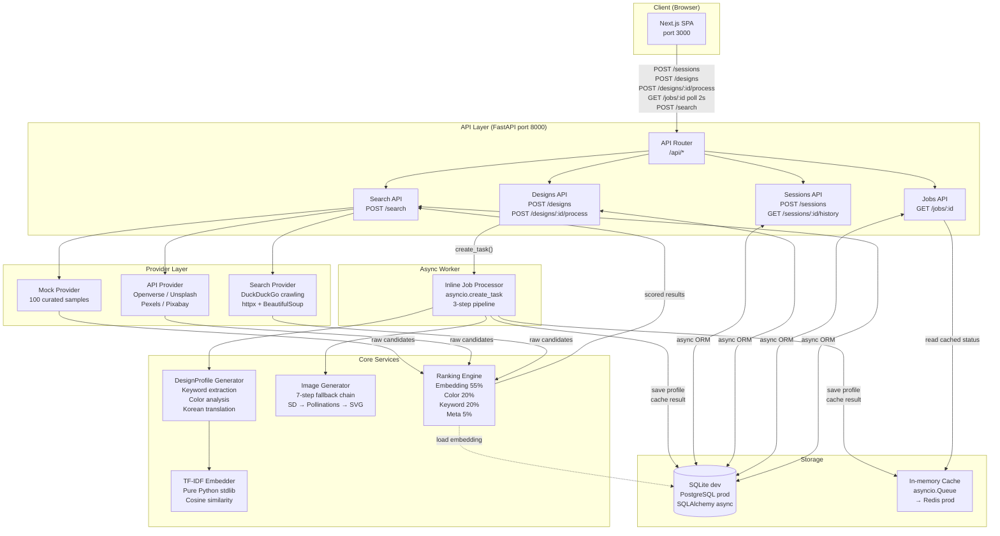

# FMD — Find My Design

> An AI-powered design asset search engine. Describe what you're looking for — in text or as a sketch — and FMD finds matching design assets across multiple sources.

---

## Problem

Designers know the visual style they want before they can name it. Searching design platforms with keywords like "minimal" or "modern" returns thousands of results with no signal about which ones match the specific visual intent. Searching across multiple platforms (Freepik, Dribbble, Behance, Unsplash) is manual and time-consuming.

The underlying problem is a vocabulary gap: visual intent is richer than keyword vocabulary.

---

## Solution

FMD translates visual intent — expressed as freeform text or a rough sketch — into a structured `DesignProfile` that drives semantic search, AI reference image generation, and multi-signal ranking.

```
User Input (text or sketch)
  → DesignProfile { keywords, dominant_color, embedding }
  → AI reference images (4 style variations)
  → Multi-provider candidate search
  → Ranked results returned to UI
```

---

## System Architecture



### Component Responsibilities

| Component | Responsibility |
|---|---|
| `DesignProfile Generator` | Normalize text/sketch input → keywords, dominant color, profile hash |
| `TF-IDF Embedder` | Build sparse embedding vector (pure Python stdlib) |
| `Image Generator` | Generate 4 style variations with 7-step API fallback chain |
| `Ranking Engine` | Score candidates on embedding (55%), color (20%), keyword (20%), meta (5%) |
| `Provider Layer` | Fan out search to multiple sources via shared `BaseProvider` interface |

---

## Frontend Architecture

```
page.tsx (state machine: idle → loading → results → error)
├── Header
│   └── [History button — conditional on session]
├── [idle state]
│   ├── InputModeTabs          # text | canvas toggle
│   ├── TextPromptPanel        # textarea (English / Korean)
│   │   └── CategorySelector   # UI / Logo / Icon / Illustration
│   ├── DrawingCanvas          # HTML5 canvas, draw/erase, brush size
│   │   └── CategorySelector
│   └── [Submit button]
├── [loading state]
│   └── Progress bar + phase label
├── [results state]
│   ├── AI Analysis Panel
│   │   ├── Keywords chips
│   │   ├── Dominant color swatch
│   │   └── 4×StyleVariation images (minimal/modern/vintage/bold)
│   └── ResultList (12-item grid)
│       └── ProductCard ×12
├── [error state]
│   └── Error message + dismiss
├── HistoryPanel               # slide-over
└── Footer
```

State is a four-value enum: `idle → loading → results → error`. All API calls are encapsulated in `lib/api.ts`; components never call `fetch` directly.

UI configuration (categories, filters, result columns) is driven by config objects in `src/configs/`, not hardcoded JSX. Adding a new category or filter is a config change.

---

## Data Flow

```
1. POST /sessions                    → session_id
2. POST /designs                     → design_id
3. POST /designs/:id/process         → job_id  [async pipeline starts]
   ├── [10%]  Generate DesignProfile (keywords + color)
   ├── [10%]  Build TF-IDF embedding
   ├── [40–70%]  Generate 4 AI style images (parallel)
   └── [100%]  Save to DB + cache result
4. GET /jobs/:id (poll every 2s)     → { progress, style_variations, keywords }
5. POST /search                      → ranked results (top 12)
```

### Ranking Formula

```python
# With embedding
score = (
  0.55 * embedding_score  +   # TF-IDF cosine similarity
  0.20 * color_score      +   # RGB Euclidean distance
  0.20 * keyword_score    +   # tag overlap count
  0.05 * meta_score           # image URL + deduplication
)

# Penalties (multiplicative)
score *= 0.6  # negative keyword match
score *= 0.9  # duplicate product URL
```

---

## Key Features

- **Multi-modal input** — freeform text (English and Korean) or HTML5 canvas sketch
- **Korean language support** — 100+ word translation map, Hangul stopword filtering
- **4 AI style variations** — minimal / modern / vintage / bold, generated in parallel
- **7-step image generation fallback** — runs without any paid API key (Pollinations → SVG)
- **Multi-provider search** — mock catalog, Openverse API, web crawling (extensible)
- **No ML library dependency** — TF-IDF embedding using only Python stdlib
- **Zero-infrastructure dev** — in-memory queue and cache, SQLite database
- **Portable DB types** — SQLite in dev, PostgreSQL in prod, no code changes required
- **Enterprise Console** — `/admin` dashboard for search observability, ranking debug, config management

### Image Generation Fallback Chain

| Priority | Backend | Requirement |
|---|---|---|
| 1 | ComfyUI (local SDXL) | Local container |
| 2 | Stability AI | `STABILITY_API_KEY` |
| 3 | HuggingFace Inference | `HF_TOKEN` (free tier) |
| 4 | Stable Horde | `STABLE_HORDE_API_KEY` |
| 5 | Pollinations.ai | None (free) |
| 6 | Openverse | None (CC-licensed search) |
| 7 | Local SVG | Always available |

---

## Engineering Decisions

**DesignProfile as an intermediate structure.** Raw text is not comparable across providers and cannot represent sketch input. The `DesignProfile` is the canonical representation that decouples multi-modal input normalization from search and ranking. The `profile_hash` (SHA256 of sorted keywords + color) enables deduplication: semantically identical queries — including Korean/English equivalents — skip re-computation and return cached results.

**Configuration-driven UI.** Filter options, categories, and result layouts are config objects, not component code. Adding a new category is a one-line config change. This also makes A/B testing UI variants low-cost: different configs, not different component trees.

**Multi-provider fan-out.** Single-provider search has a recall ceiling. The fan-out architecture improves coverage by adding providers without modifying ranking logic. The `BaseProvider` interface ensures new sources integrate without changes to the search endpoint.

**No external ML libraries.** TF-IDF embedding is implemented with only Python stdlib (`math`, `json`, `collections`), eliminating cold-start penalties and heavy dependencies. The embedder interface is a clean contract — swapping in a sentence-transformer or CLIP encoder requires no changes to ranking or storage.

**Zero-infrastructure development.** `core/redis.py` implements the full Redis interface (`get`, `set`, `lpush`, `blpop`, `acquire_lock`) using Python's `asyncio.Queue` and a `dict`. The entire system runs with SQLite and in-memory queue — no Docker, no Redis, no Postgres required to start developing.

---

## Future Improvements

| Area | Direction |
|---|---|
| Embedding | Replace TF-IDF with sentence-transformer or CLIP for higher semantic accuracy |
| Visual search | Route canvas input to CLIP visual encoder, add `visual_score` ranking signal |
| User signals | Track clicks and favorites, add personalization weight to ranking |
| Provider coverage | Add Dribbble, Behance, Freepik provider implementations |
| Caching | Profile-level result caching: identical `profile_hash` returns stored results |
| Auth | Optional account for persistent history and saved searches |
| Observability | Structured logging per job, provider hit rate dashboard |

---

## Local Setup

### Prerequisites

- Node.js 18+ & pnpm
- Python 3.10+

### Install

```bash
# Clone
git clone https://github.com/devbinlog/FMD.git
cd FMD

# Backend
cd backend && pip install -r requirements.txt
cd ..

# Frontend
cd frontend && pnpm install
cd ..
```

### Environment Variables (all optional)

Create `backend/.env`:

```bash
# AI image generation (priority order — one is enough)
HF_TOKEN=hf_...                # HuggingFace free tier (recommended)
STABILITY_API_KEY=sk-...       # Stability AI (Stable Diffusion)
COMFYUI_URL=http://...         # Local ComfyUI server

# Search result images (optional — Openverse works without keys)
UNSPLASH_ACCESS_KEY=...
PEXELS_API_KEY=...
PIXABAY_API_KEY=...
```

> All API keys are optional. The full pipeline works without any key using Openverse (CC-licensed) and 100 built-in mock samples.

### Run

```bash
pnpm dev        # Frontend (:3000) + Backend (:8000) concurrently

pnpm dev:fe     # Frontend only  → http://localhost:3000
pnpm dev:be     # Backend only   → http://localhost:8000
                #                  http://localhost:8000/docs  (Swagger UI)
```

### Test

```bash
pnpm test:be                     # All backend tests
pnpm test:be:one "test_name"     # Single test
```
---

### Sample Output

100 built-in mock samples — example: searching "고양이" (cat)


---

## Project Structure

```
├── backend/
│   ├── app/
│   │   ├── api/            # FastAPI route handlers (5 endpoints)
│   │   ├── core/           # Config, DB engine, portable types, in-memory cache
│   │   ├── models/         # SQLAlchemy ORM (7 tables)
│   │   ├── schemas/        # Pydantic v2 request/response models
│   │   ├── providers/      # BaseProvider + mock / api / search implementations
│   │   ├── services/
│   │   │   ├── profile_generator.py   # Keyword extraction + color analysis
│   │   │   ├── image_generator.py     # AI image gen (7-step fallback)
│   │   │   ├── embedder.py            # TF-IDF embedding (stdlib only)
│   │   │   └── ranking.py             # Multi-signal ranking algorithm
│   │   ├── worker/         # Inline async job processor
│   │   └── main.py         # FastAPI entry + DB init + provider seeding
│   ├── tests/              # pytest test suite
│   └── requirements.txt
├── frontend/
│   ├── src/
│   │   ├── app/            # Next.js pages (SPA + /admin console)
│   │   ├── components/     # 9 React components
│   │   ├── configs/        # Category / filter / column config objects
│   │   ├── lib/api.ts      # API client + job polling
│   │   └── types/api.ts    # TypeScript type definitions
│   └── package.json
├── docs/                   # Engineering design documents
└── package.json            # Root workspace scripts
```

---

## API Reference

| Method | Path | Description |
|---|---|---|
| `POST` | `/api/sessions` | Create search session |
| `GET` | `/api/sessions/{id}/history` | Fetch session search history (last 20) |
| `POST` | `/api/designs` | Submit design (text or canvas) |
| `POST` | `/api/designs/{id}/process` | Start async AI processing job |
| `GET` | `/api/jobs/{id}` | Poll job status and progress |
| `POST` | `/api/search` | Run ranked search against providers |
| `GET` | `/health` | Health check |

---

## Tech Stack

| Layer | Technology |
|---|---|
| Frontend | Next.js 16 · React 19 · TypeScript · Tailwind CSS v4 |
| Backend | FastAPI · Python 3.11 · Pydantic v2 |
| ORM | SQLAlchemy 2.0 async |
| Database | SQLite (dev) / PostgreSQL (prod) |
| Queue / Cache | asyncio.Queue (dev) / Redis (prod) |
| HTTP Client | httpx (async) |
| Scraping | BeautifulSoup4 + lxml |
| AI Images | Stability AI / HuggingFace / Pollinations.ai |
| Icons | Lucide React |

---

*FMD is a portfolio project demonstrating full-stack product engineering: async API design, multi-modal AI pipeline, semantic search, and configuration-driven frontend architecture.*
